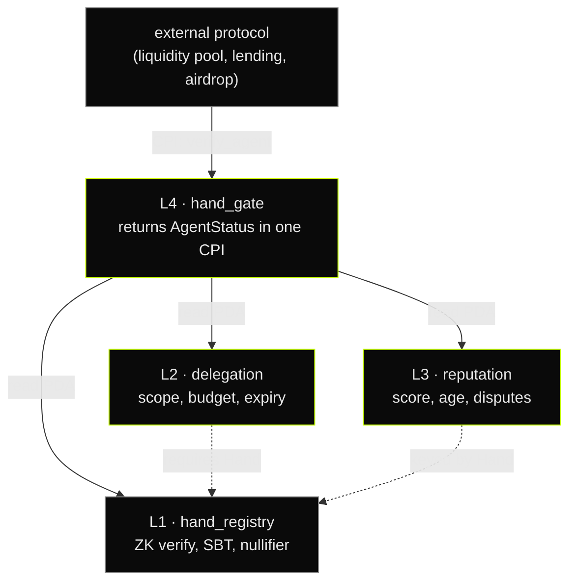

<p align="center">
  
</p>

<h1 align="center">
  Accountable agents.<br/>
  <sub>Anonymous humans.</sub>
</h1>

<p align="center">
  <code>v0.4.1</code> &nbsp;·&nbsp; <code>Solana devnet</code> &nbsp;·&nbsp; <code>Anchor 0.30</code> &nbsp;·&nbsp; <code>Groth16 / BN254</code>
</p>

<p align="center">
  <a href="https://github.com/WritNetwork/writ/actions/workflows/ci.yml"></a>
  <a href="https://github.com/WritNetwork/writ/releases"></a>
  <a href="LICENSE"></a>
  <a href="https://github.com/WritNetwork/writ/commits/main"></a>
  <a href="https://github.com/WritNetwork/writ/stargazers"></a>
  <a href="https://x.com/writnetwork"></a>
  <a href="https://writ.network"></a>
</p>

<table align="center">
  <tr>
    <td align="center" width="140">
      <sub><code>01</code></sub><br/>
      <h1><code>4</code></h1>
      <sub><b>Programs</b></sub><br/>
      <sub><sup>Anchor workspace</sup></sub>
    </td>
    <td align="center" width="140">
      <sub><code>02</code></sub><br/>
      <h1><code>1</code></h1>
      <sub><b>CPI to verify</b></sub><br/>
      <sub><sup>One function call</sup></sub>
    </td>
    <td align="center" width="140">
      <sub><code>03</code></sub><br/>
      <h1><code>0</code></h1>
      <sub><b>Biometrics</b></sub><br/>
      <sub><sup>Zero PII stored</sup></sub>
    </td>
    <td align="center" width="140">
      <sub><code>04</code></sub><br/>
      <h1><code>∞</code></h1>
      <sub><b>Agents</b></sub><br/>
      <sub><sup>Per human operator</sup></sub>
    </td>
  </tr>
</table>

## §1 &nbsp; The gap

Solana agents already trade, bridge, and pay &mdash; right now. Every one of them is anonymous. Counterparties cannot tell whether a wallet is backed by a human with reputational skin in the game, or by code with no owner and nothing to lose. Protocols that want to gate access &mdash; liquidity pools, airdrops, lending markets, matchmaking &mdash; have no on-chain primitive to check this.

HAND is that primitive.

```
┌─ What HAND answers in one CPI ──────────────────────────────┐
│                                                             │
│   ( 1 )   Is a real human behind this wallet?               │
│   ( 2 )   What is this agent allowed to do?                 │
│   ( 3 )   Has this agent earned trust over time?            │
│                                                             │
└─────────────────────────────────────────────────────────────┘
```

No biometrics. No cameras. No off-chain dependency. Just cryptography.

## §2 &nbsp; Architecture

Four on-chain programs form a layered verification stack. External protocols only ever touch the top layer (`hand_gate`), which reads from the three layers below in a single cross-program invocation.

<table>
  <thead>
    <tr><th align="left">Layer</th><th align="left">Program</th><th align="left">Role</th><th align="left">State</th></tr>
  </thead>
  <tbody>
    <tr><td><code>L4</code></td><td><code>hand_gate</code></td><td>Single verification entrypoint. Returns <code>AgentStatus</code> in one CPI.</td><td>stateless</td></tr>
    <tr><td><code>L3</code></td><td><code>reputation</code></td><td>0&ndash;10,000 score from on-chain behavior. Stake-based disputes.</td><td><code>ReputationAccount</code></td></tr>
    <tr><td><code>L2</code></td><td><code>delegation</code></td><td>Scoped permissions: program whitelist, budget cap, expiry.</td><td><code>DelegationScope</code></td></tr>
    <tr><td><code>L1</code></td><td><code>hand_registry</code></td><td>ZK Groth16 (BN254) proof verification. Poseidon nullifier. Token-2022 SBT.</td><td><code>HandAccount</code></td></tr>
  </tbody>
</table>



### Design properties

- **Single CPI surface.** Any Solana program gates an instruction by calling `hand_gate::verify_agent` once.
- **No off-chain dependency.** All state is on-chain. No oracle, no relayer, no trusted fetcher.
- **No circular dependencies.** L4 reads L1/L2/L3. L2 and L3 read L1. L1 reads nothing.
- **Budget-aware.** Full four-program verification fits inside the Solana 200k compute-unit budget.
- **Explicit failure modes.** `AgentStatus.is_valid` is a single boolean: true if and only if the Hand exists, the delegation is unrevoked and unexpired, the budget is not exhausted, and the score clears the caller's threshold.

## §3 &nbsp; The one call

```rust
use hand_gate::{cpi, cpi::accounts::VerifyAgentAccounts};

pub fn sensitive_swap(ctx: Context<SensitiveSwap>, amount_in: u64) -> Result<()> {
    // One CPI. One branch. No off-chain dependency.
    let status = cpi::verify_agent(
        CpiContext::new(ctx.accounts.hand_gate_program.to_account_info(), VerifyAgentAccounts {
            delegation: ctx.accounts.delegation.to_account_info(),
            hand: ctx.accounts.hand.to_account_info(),
            clock: ctx.accounts.clock.to_account_info(),
        }),
        ctx.accounts.agent.key(),
    )?;

    require!(status.is_valid, ErrorCode::NotHumanBacked);
    require!(status.score >= 500, ErrorCode::InsufficientReputation);
    require!(status.scope.allows(&ctx.program_id, amount_in), ErrorCode::OutOfScope);

    //  proceed with privileged logic
    Ok(())
}
```

<details>
<summary><b>TypeScript — same verification, client-side</b></summary>

```typescript
import { HandProtocol } from "@writnetwork/sdk";
import { Connection, PublicKey } from "@solana/web3.js";

const connection = new Connection("https://api.devnet.solana.com");
const hand = new HandProtocol(connection, {
  handRegistry: new PublicKey("FrEcFzPx9zqooVp1GmkMdiNXkpgcx3UJRN97YUR9MFTk"),
  delegation:   new PublicKey("EnoPMLDuLo33PUvYBekpaTzyembPuZD82PAcv3qvRFxK"),
  reputation:   new PublicKey("F8yFcvoXpupNahzJ2wSKDBErqKgmE7ws1gVVtdAq33FC"),
  handGate:     new PublicKey("3tpfhT2m1vF7FCLsGazbEPFRiRnjgwk2CnC3yeonas7M"),
});

const status = await hand.verifyAgent(agentPublicKey);
// { isValid: true, handKey: "7xKq...", reputationScore: 8200,
//   delegatedAt: 1713024000, expiresAt: 1713283200, allowedActions: 1 }
```

</details>

<details>
<summary><b>CLI — mint, delegate, verify from the terminal</b></summary>

```bash
hand mint       --keypair ~/.config/solana/id.json --cluster devnet
hand delegate   --agent BotW...5kP --max-sol 10 --expires 2026-12-31 --actions swap,stake
hand verify     --agent BotW...5kP
# Output: is_valid=true  score=8200  scope=[swap,stake]  expires=1713283200
```

</details>

## §4 &nbsp; Deployments

<table>
  <thead><tr><th align="left">Program</th><th align="left">Devnet Program ID</th><th align="center">Explorer</th></tr></thead>
  <tbody>
    <tr><td><code>hand_gate</code></td><td><code>3tpfhT2m1vF7FCLsGazbEPFRiRnjgwk2CnC3yeonas7M</code></td><td align="center"><a href="https://explorer.solana.com/address/3tpfhT2m1vF7FCLsGazbEPFRiRnjgwk2CnC3yeonas7M?cluster=devnet">↗</a></td></tr>
    <tr><td><code>reputation</code></td><td><code>F8yFcvoXpupNahzJ2wSKDBErqKgmE7ws1gVVtdAq33FC</code></td><td align="center"><a href="https://explorer.solana.com/address/F8yFcvoXpupNahzJ2wSKDBErqKgmE7ws1gVVtdAq33FC?cluster=devnet">↗</a></td></tr>
    <tr><td><code>delegation</code></td><td><code>EnoPMLDuLo33PUvYBekpaTzyembPuZD82PAcv3qvRFxK</code></td><td align="center"><a href="https://explorer.solana.com/address/EnoPMLDuLo33PUvYBekpaTzyembPuZD82PAcv3qvRFxK?cluster=devnet">↗</a></td></tr>
    <tr><td><code>hand_registry</code></td><td><code>FrEcFzPx9zqooVp1GmkMdiNXkpgcx3UJRN97YUR9MFTk</code></td><td align="center"><a href="https://explorer.solana.com/address/FrEcFzPx9zqooVp1GmkMdiNXkpgcx3UJRN97YUR9MFTk?cluster=devnet">↗</a></td></tr>
  </tbody>
</table>

Mainnet deployment pending external audit.

## §5 &nbsp; Reputation scoring

```
base       = (successful_actions / total_actions) × 10000
penalty    = disputes_lost × 500
age_bonus  = min(days_active × 10, 1000)
score      = clamp(base − penalty + age_bonus, 0, 10000)
```

Any program can gate on reputation:

```rust
#[hand_gated(min_reputation = 5000)]
pub fn quality_gate(ctx: Context<X>) -> Result<()> { /* ... */ }
```

## §6 &nbsp; Delegation scope

<table>
  <thead><tr><th align="left">Field</th><th align="left">Type</th><th align="left">Purpose</th></tr></thead>
  <tbody>
    <tr><td><code>allowed_programs</code></td><td><code>Vec&lt;Pubkey&gt;</code></td><td>Whitelist. Empty = no restriction.</td></tr>
    <tr><td><code>max_lamports_per_tx</code></td><td><code>u64</code></td><td>Per-transaction spending cap</td></tr>
    <tr><td><code>max_lamports_total</code></td><td><code>u64</code></td><td>Lifetime spending cap</td></tr>
    <tr><td><code>expires_at</code></td><td><code>i64</code></td><td>Unix timestamp. 0 = no expiry.</td></tr>
    <tr><td><code>allowed_actions</code></td><td><code>u16</code></td><td>Bitflags: <code>SWAP=1 STAKE=2 TRANSFER=4 VOTE=8 MINT=16</code></td></tr>
  </tbody>
</table>

## §7 &nbsp; Build

```bash
git clone https://github.com/WritNetwork/writ.git
cd writ
anchor build
anchor test
```

Requires: Rust 1.78+, Solana CLI 1.18.26, Anchor 0.30.1, Node 20+.

## §8 &nbsp; Threat model

<table>
  <thead><tr><th align="left">Threat</th><th align="left">Mitigation</th><th align="center">Residual</th></tr></thead>
  <tbody>
    <tr><td>Nullifier rainbow attack</td><td>Poseidon hash with per-user secret; no precomputation</td><td align="center"><code>negligible</code></td></tr>
    <tr><td>Agent exceeds scope</td><td>On-chain budget enforcement via <code>consume()</code></td><td align="center"><code>enforced</code></td></tr>
    <tr><td>Bought social accounts</td><td>Account age + follower thresholds filter ~90%</td><td align="center"><code>low</code></td></tr>
    <tr><td>Malicious agent behavior</td><td>Stake-based dispute system with reputation penalty</td><td align="center"><code>medium</code></td></tr>
    <tr><td>Verification key compromise</td><td>Trusted setup ceremony; key embedded in program binary</td><td align="center"><code>low</code></td></tr>
  </tbody>
</table>

## §9 &nbsp; Repository map

```
writ/
├─ programs/
│  ├─ hand-registry/    L1  ZK verification · SBT minting
│  ├─ delegation/       L2  scoped permissions · budget · expiry
│  ├─ reputation/       L3  scoring · disputes · reporters
│  └─ hand-gate/        L4  CPI verification interface
├─ sdk/                     TypeScript client library
├─ cli/                     Rust command-line tool
├─ tests/                   Anchor integration tests
├─ examples/                Usage scripts
├─ docs/                    Architecture · ZK · delegation · integration
└─ idl/                     Anchor IDL JSON
```

<p align="center"><sub><code>─────────────────────────────────────────────────────────────</code></sub></p>

<table align="center" width="100%">
  <tr>
    <td align="center"><a href="https://writ.network">writ.network</a></td>
    <td align="center"><a href="https://x.com/writnetwork">@writnetwork</a></td>
    <td align="center"><a href="CONTRIBUTING.md">Contributing</a></td>
    <td align="center"><a href="SECURITY.md">Security</a></td>
    <td align="center"><a href="docs/self-audit.md">Self-audit</a></td>
    <td align="center"><a href="LICENSE">MIT License</a></td>
  </tr>
</table>

<p align="center"><sub>Built with Rust, Anchor 0.30, ark-bn254, TypeScript. Single-author. Solana-native.</sub></p>
